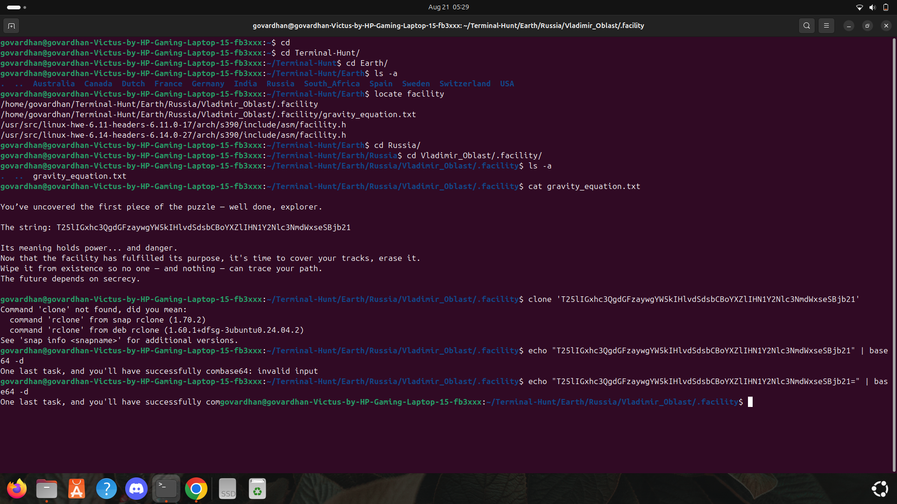
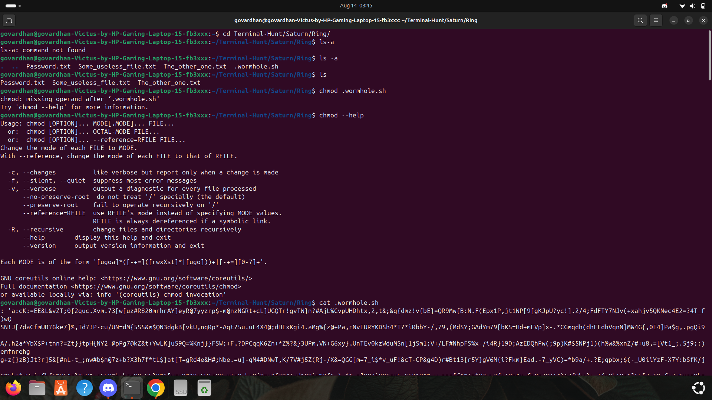
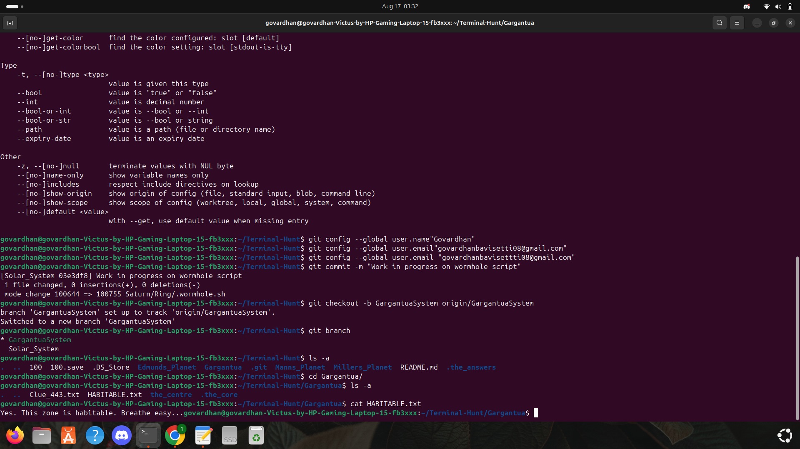
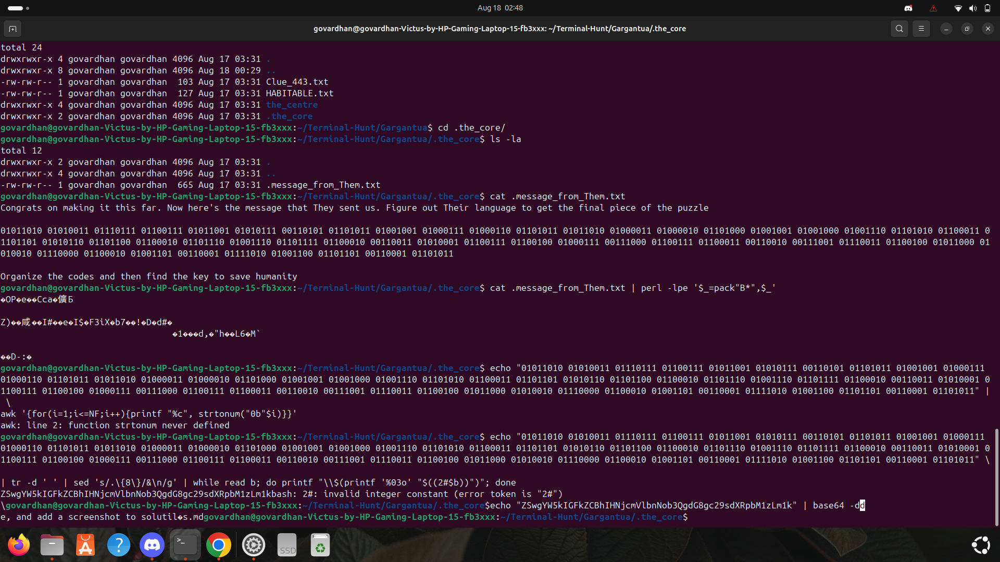

## Task1
##### Find the facility
###### I have learnt some commands for using the terminal in Linux after I have cloned the git repository in my Home page. After I entered into Terminal-Hunt folder by using command "cd".
##### so after i have entered into Earth named folder. I have located the facility file in Earth folder using "locate" command. After I have found it in Russia/Vladimir_oblast. 
##### so i have gone into Vladimir_oblast/.facility and used "cat" command to find the contents in the file gravity_equatioon.txt.
##### So in that i have found my first key for the puzzle and i have copied it and stored it in a seperate file named keys.txt and saved the decoded word also in that keys.txt file 

Task2

Task3

Task4

