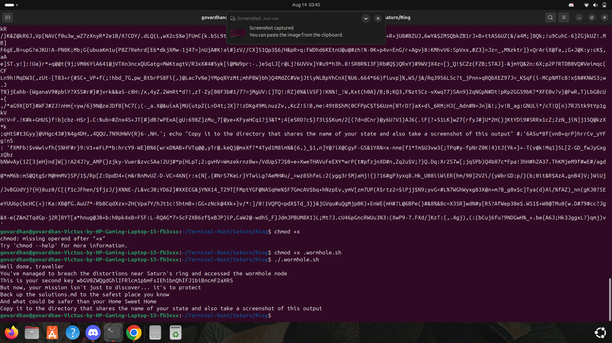

## Task1
### Find the facility
###### I have learnt some commands for using the terminal in Linux after I have cloned the git repository in my Home page. After I entered into Terminal-Hunt folder by using command "cd".
##### so after i have entered into Earth named folder. I have located the facility file in Earth folder using "locate" command. After I have found it in Russia/Vladimir_oblast. 
##### so i have gone into Vladimir_oblast/.facility and used "cat" command to find the contents in the file gravity_equatioon.txt.
##### So in that i have found my first key for the puzzle and i have copied it and stored it in a seperate file named keys.txt and saved the decoded word also in that keys.txt file
### I have used echo command to decode the key 

## Task2
### Enter the Wormhole
##### I have searched for the wormhole file using "locate" command
##### I have seen that it is in the Saturn/Ring and i have accessed it by the command "chmod +x" and "./" command
##### After that I have created a file named solutions.md using the command touch and saved it in my homestate named folder "Andhrapradesh"

## Task3
### Analyze the planets in Gargantuan System
##### This one is about to change the git branch from Solar_System to Gargabtua. So for this i have used a command "git checkout -b" git checkout -b Gargantuasystem
##### By this the  git branch had changed to Gargantua from Solar_System
##### So in that Gargantuasystem I have found a file named HABITABLE.txt. So by going through it I have found that this zone is habitable 

## Task4
### Gargantua
##### In this we need to find a message from them. So I have gone through the folder named .the_core and gone through the file named message_from_Them.txt
##### In that I have a base-64 coded word.So I have decoded it by using echo command 
##### After that I have stored the key and decoded version of that in the keys.txt file 

#### At last I have stored all the screenshots in the solutions.md file and pushed into Git-Hub repository
